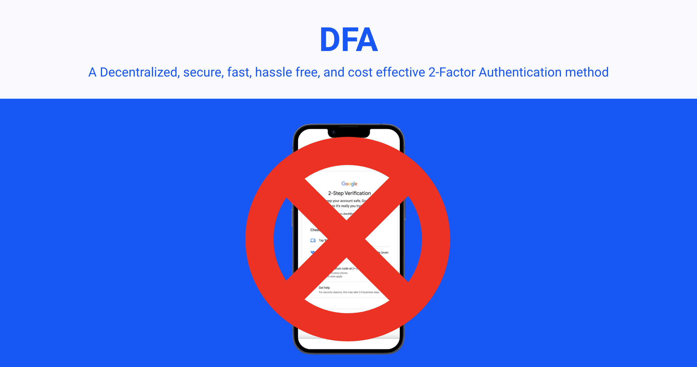

# DFA
DFA or Decentralized Factor Authentication is a 2FA method to succeed 2FA SMS.

*click to view deck
____

## Features
- Customizable
- Lightwieght
- OTP 
- Identity verification (KYC)
- Security

## Install
